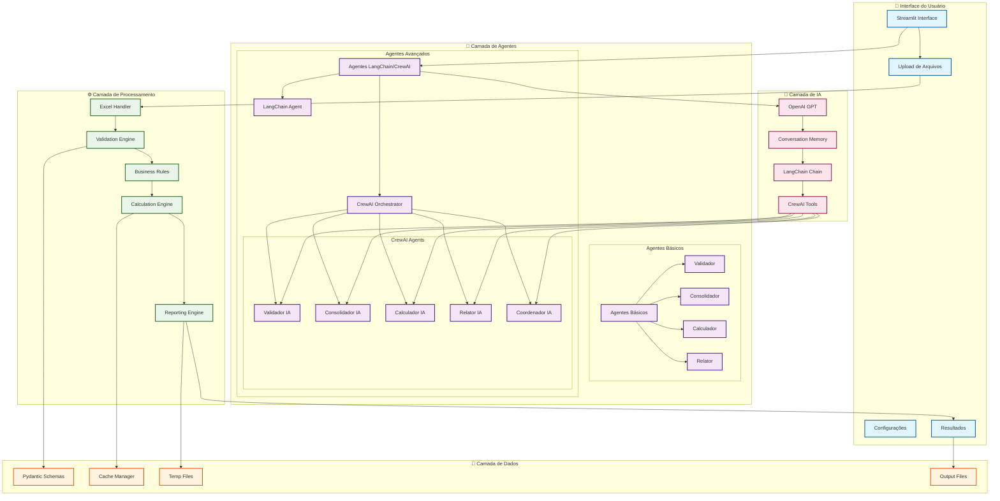
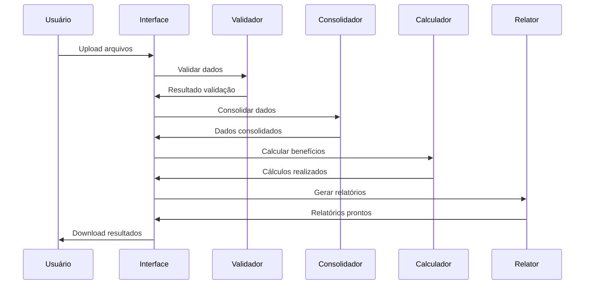
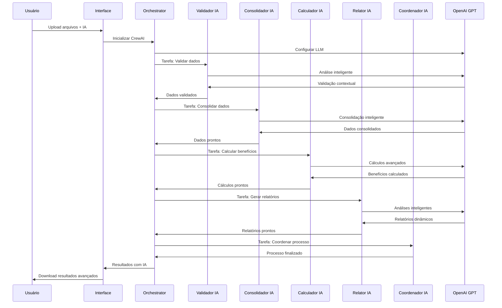

# 🤖 Automação VR/VA - Sistema Inteligente

Sistema automatizado para cálculo de Vale Refeição (VR/VA) com interface web intuitiva e processamento inteligente de dados.

## 🎯 Objetivo

Automatizar o processo mensal de compra de VR (Vale Refeição), garantindo que cada colaborador receba o valor correto, considerando ausências, férias, datas de admissão/desligamento e calendário de feriados.

## ✨ Funcionalidades

- **📁 Upload Inteligente**: Interface drag & drop para múltiplas planilhas
- **🔍 Validação Automática**: Verificação de integridade dos dados
- **⚖️ Regras de Negócio**: Aplicação automática de regras específicas
- **🧮 Cálculo Automático**: Processamento inteligente de benefícios
- **📊 Relatórios**: Geração automática de planilhas formatadas
- **📈 Análises**: Visualizações e métricas em tempo real

## 🏗️ Arquitetura

### Diagrama da Arquitetura



### Stack Tecnológico
- **Backend**: Python 3.9+
- **Interface Web**: Streamlit
- **Manipulação de Dados**: Pandas + OpenPyXL
- **Validação**: Pydantic
- **Visualização**: Plotly
- **IA**: LangChain + CrewAI + OpenAI GPT

### Estrutura do Projeto
```
vr_automation/
├── app.py                          # Interface Streamlit principal
├── agents/                         # Agentes de IA
│   ├── __init__.py                # Agentes básicos
│   └── langchain_agents.py        # Agentes LangChain/CrewAI
├── components/                     # Componentes Streamlit
├── data/                          # Dados temporários e cache
├── schemas/                       # Schemas de validação
├── utils/                         # Utilitários
├── config/                        # Configurações
├── pages/                         # Páginas Streamlit
├── tests/                         # Testes
├── demo_langchain_crewai.py       # Demonstração IA
└── requirements.txt               # Dependências
```

### Modalidades de Processamento

#### 🔄 Fluxo de Processamento Básico


#### 🚀 Fluxo de Processamento Avançado (IA)


## 🚀 Instalação

### Pré-requisitos
- Python 3.9 ou superior
- pip (gerenciador de pacotes Python)

### Passos de Instalação

1. **Clone o repositório**
```bash
git clone <url-do-repositorio>
cd vr_automation
```

2. **Crie um ambiente virtual (recomendado)**
```bash
python -m venv venv
source venv/bin/activate  # Linux/Mac
# ou
venv\Scripts\activate     # Windows
```

3. **Instale as dependências**
```bash
pip install -r requirements.txt
```

4. **Execute a aplicação**
```bash
streamlit run app.py
```

## 📖 Como Usar

### 1. Acesso à Interface
Após executar o comando `streamlit run app.py`, a aplicação estará disponível em:
```
http://localhost:8501
```

### 2. Seleção do Tipo de Processamento
O sistema oferece duas modalidades de processamento:

#### 🔄 **Agentes Básicos** (Recomendado para início)
- Processamento rápido e eficiente
- Validações e cálculos diretos
- Ideal para processamento em lote
- Não requer configuração de API

#### 🚀 **Agentes Avançados (LangChain/CrewAI)** (Recomendado para análise avançada)
- Processamento com inteligência artificial
- Validações contextuais e inteligentes
- Análises avançadas e insights personalizados
- Requer configuração de `OPENAI_API_KEY`

### 3. Upload de Arquivos
No painel lateral, faça upload das seguintes planilhas:
- **Colaboradores Ativos**: Lista de colaboradores ativos
- **Colaboradores em Férias**: Colaboradores em período de férias
- **Colaboradores Desligados**: Colaboradores que foram desligados
- **Novos Admitidos**: Colaboradores admitidos no período
- **Afastamentos**: Colaboradores afastados
- **Base Sindicato x Valor**: Valores de VR por sindicato
- **Base Dias Úteis**: Dias úteis por sindicato
- **Estagiários**: Lista de estagiários
- **Aprendizes**: Lista de aprendizes
- **Colaboradores Exterior**: Colaboradores no exterior

### 3. Configurações
Defina o mês e ano de referência para o processamento.

### 4. Processamento
Clique em "🚀 Processar VR/VA" para iniciar a automação.

### 5. Resultados
Visualize os resultados e faça download da planilha final.

## 📊 Regras de Negócio

### Exclusões Automáticas
- Diretores
- Estagiários
- Aprendizes
- Colaboradores afastados (licença maternidade, etc.)
- Profissionais no exterior

### Regras de Desligamento
- **Comunicado até dia 15**: Não considerar pagamento
- **Comunicado após dia 15**: Compra proporcional

### Cálculo de Custos
- **Empresa**: 80% do valor total
- **Funcionário**: 20% descontado

### Considerações Especiais
- Férias parciais ou integrais
- Afastamentos temporários
- Feriados nacionais/estaduais/municipais
- Datas de admissão/desligamento no meio do mês

## 🔧 Configuração

### Variáveis de Ambiente
Crie um arquivo `.env` na raiz do projeto:

```env
# Configurações Gerais
DEBUG=True
LOG_LEVEL=INFO
CACHE_ENABLED=True
MAX_FILE_SIZE=50MB
TEMP_DIR=data/temp
CACHE_DIR=data/cache

# Configuração OpenAI (para Agentes Avançados)
OPENAI_API_KEY=sua_chave_api_openai_aqui
OPENAI_MODEL=gpt-3.5-turbo
```

### Configurações Streamlit
Crie um arquivo `.streamlit/config.toml`:

```toml
[server]
port = 8501
address = "localhost"

[browser]
gatherUsageStats = false

[theme]
primaryColor = "#FF6B6B"
backgroundColor = "#FFFFFF"
secondaryBackgroundColor = "#F0F2F6"
textColor = "#262730"
```

## 🧪 Testes e Demonstrações

### Executar Testes
```bash
python -m pytest tests/
```

### Cobertura de Testes
```bash
python -m pytest --cov=. tests/
```

### Demonstração dos Agentes IA
Para testar a integração LangChain/CrewAI:

```bash
cd vr_automation
python demo_langchain_crewai.py
```

Este script demonstra:
- Arquitetura dos agentes
- Benefícios da integração
- Testes de funcionalidade
- Configuração do sistema

## 📈 Métricas de Sucesso

### Funcionais
- ✅ Redução de 90% no tempo de processamento
- ✅ Eliminação de erros manuais
- ✅ Consistência nos cálculos
- ✅ Geração automática de relatórios

### Técnicas
- ✅ Tempo de resposta < 30 segundos
- ✅ Disponibilidade > 99%
- ✅ Taxa de erro < 1%
- ✅ Cobertura de testes > 80%

## 🤝 Contribuição

### Como Contribuir

1. **Fork o projeto**
2. **Crie uma branch para sua feature**
```bash
git checkout -b feature/nova-funcionalidade
```

3. **Faça commit das mudanças**
```bash
git commit -m 'Adiciona nova funcionalidade'
```

4. **Push para a branch**
```bash
git push origin feature/nova-funcionalidade
```

5. **Abra um Pull Request**

### Padrões de Código

- Use **Black** para formatação
- Use **Flake8** para linting
- Siga as convenções PEP 8
- Documente funções e classes
- Escreva testes para novas funcionalidades

## 📝 Licença

Este projeto está sob a licença MIT. Veja o arquivo [LICENSE](LICENSE) para mais detalhes.

## 📞 Suporte

Para dúvidas, sugestões ou problemas:

- **Email**: suporte@empresa.com
- **Issues**: [GitHub Issues](https://github.com/empresa/vr-automation/issues)
- **Documentação**: [Wiki do Projeto](https://github.com/empresa/vr-automation/wiki)

## 🔄 Changelog

### v1.1.0 (2024-12-XX) - Integração IA
- ✅ Integração LangChain/CrewAI
- ✅ Agentes de IA especializados
- ✅ Processamento com OpenAI GPT
- ✅ Validações inteligentes
- ✅ Análises avançadas
- ✅ Relatórios dinâmicos
- ✅ Interface dual (Básico/Avançado)

### v1.0.0 (2024-12-XX) - Versão Base
- ✅ Interface Streamlit completa
- ✅ Upload de múltiplas planilhas
- ✅ Validação automática de dados
- ✅ Aplicação de regras de negócio
- ✅ Cálculo automático de benefícios
- ✅ Geração de relatórios
- ✅ Download de resultados

---

**Desenvolvido com ❤️ pela equipe de Automação**
