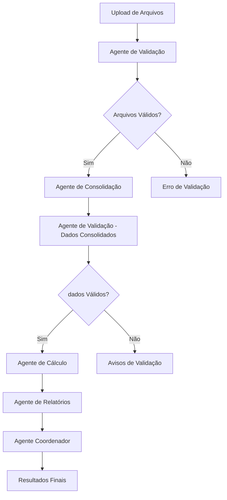

# 🤖 Agentes de IA - Sistema VR/VA

## 📋 Visão Geral

O sistema de automação VR/VA foi implementado com uma arquitetura de **agentes de IA especializados** que trabalham em conjunto para processar dados de forma inteligente e automatizada. Cada agente possui responsabilidades específicas e se comunica com os outros para garantir um processamento completo e confiável.

## 🏗️ Arquitetura dos Agentes

### 🤖 Agente Coordenador (`CoordinatorAgent`)
**Responsabilidade**: Orquestrar todo o processo de VR/VA

**Funcionalidades**:
- Coordena a execução de todos os outros agentes
- Gerencia o fluxo de processamento
- Monitora o progresso e status de cada etapa
- Consolida resultados de todos os agentes
- Gerencia logs de processamento

**Métodos Principais**:
- `process_vr_va_request()`: Processa solicitação completa
- `get_processing_status()`: Retorna status do processamento

### 📊 Agente de Consolidação (`DataConsolidatorAgent`)
**Responsabilidade**: Consolidar e limpar dados de múltiplos arquivos

**Funcionalidades**:
- Consolida dados de funcionários ativos, admitidos e desligados
- Aplica dados complementares (férias, afastamentos, etc.)
- Remove duplicatas e resolve conflitos
- Valida dados consolidados
- Enriquece dados com informações adicionais

**Métodos Principais**:
- `consolidate_employee_data()`: Consolida dados de funcionários
- `_consolidate_active_employees()`: Consolida funcionários ativos
- `_consolidate_admission_employees()`: Consolida admissões
- `_consolidate_termination_employees()`: Consolida desligamentos
- `_apply_complementary_data()`: Aplica dados complementares

### 🔍 Agente de Validação (`ValidatorAgent`)
**Responsabilidade**: Validar qualidade e integridade dos dados

**Funcionalidades**:
- Valida estrutura e conteúdo de arquivos Excel
- Realiza validação cruzada entre arquivos
- Valida dados de funcionários consolidados
- Verifica integridade geral dos dados
- Identifica erros e avisos de qualidade

**Métodos Principais**:
- `validate_uploaded_files()`: Valida arquivos enviados
- `validate_employee_data()`: Valida dados de funcionários
- `_validate_single_file()`: Valida arquivo individual
- `_cross_validate_files()`: Validação cruzada
- `_validate_data_integrity()`: Valida integridade

### 💰 Agente de Cálculo (`CalculatorAgent`)
**Responsabilidade**: Calcular benefícios VR/VA

**Funcionalidades**:
- Carrega dados de referência (sindicatos, valores, etc.)
- Aplica regras de exclusão
- Calcula dias úteis por funcionário
- Calcula valores VR/VA
- Aplica regras específicas de negócio
- Valida cálculos realizados

**Métodos Principais**:
- `calculate_benefits_for_employees()`: Calcula benefícios
- `_load_reference_data()`: Carrega dados de referência
- `_apply_exclusion_rules()`: Aplica regras de exclusão
- `_calculate_working_days()`: Calcula dias úteis
- `_calculate_vr_va_values()`: Calcula valores VR/VA

### 📋 Agente de Relatórios (`ReporterAgent`)
**Responsabilidade**: Gerar relatórios e análises

**Funcionalidades**:
- Gera relatório principal em Excel
- Cria resumo executivo
- Realiza análises estatísticas
- Gera visualizações gráficas
- Cria relatório de validação
- Consolida todos os relatórios

**Métodos Principais**:
- `generate_comprehensive_report()`: Gera relatório abrangente
- `_generate_main_excel_report()`: Relatório principal Excel
- `_generate_executive_summary()`: Resumo executivo
- `_generate_statistical_analysis()`: Análise estatística
- `_generate_visualizations()`: Visualizações gráficas

## 🔄 Fluxo de Processamento



## 📁 Estrutura de Arquivos

```
agents/
├── __init__.py              # Exporta todos os agentes
├── coordinator.py           # Agente coordenador
├── data_consolidator.py     # Agente de consolidação
├── validator.py             # Agente de validação
├── calculator.py            # Agente de cálculo
└── reporter.py              # Agente de relatórios
```

## 🚀 Como Usar os Agentes

### 1. Importar Agentes
```python
from agents import (
    CoordinatorAgent,
    DataConsolidatorAgent,
    ValidatorAgent,
    CalculatorAgent,
    ReporterAgent
)
```

### 2. Inicializar Agentes
```python
# Inicializar todos os agentes
coordinator = CoordinatorAgent()
validator = ValidatorAgent()
consolidator = DataConsolidatorAgent()
calculator = CalculatorAgent()
reporter = ReporterAgent()
```

### 3. Processar com Agentes
```python
# Validar arquivos
validation_result = validator.validate_uploaded_files(uploaded_files)

# Consolidar dados
consolidation_result = consolidator.consolidate_employee_data(uploaded_files)

# Calcular benefícios
calculation_result = calculator.calculate_benefits_for_employees(
    consolidation_result['data'], month, year, uploaded_files
)

# Gerar relatórios
report_result = reporter.generate_comprehensive_report(
    calculation_result['data'], month, year, calculation_result['summary']
)
```

### 4. Usar Agente Coordenador (Recomendado)
```python
# Processamento completo com agente coordenador
final_result = coordinator.process_vr_va_request(
    uploaded_files, month, year
)
```

## 📊 Logs e Monitoramento

Cada agente mantém logs detalhados de suas operações:

### Estrutura do Log
```python
{
    'step': 'nome_da_etapa',
    'status': 'success|error|warning',
    'message': 'Descrição da operação',
    'timestamp': '2025-01-XX...',
    'details': {
        # Detalhes específicos da operação
    }
}
```

### Acessar Logs
```python
# Logs do agente de validação
validation_log = validator.get_validation_summary()

# Logs do agente de consolidação
consolidation_log = consolidator.get_consolidation_summary()

# Logs do agente de cálculo
calculation_log = calculator.get_calculation_summary()

# Logs do agente de relatórios
report_log = reporter.get_report_summary()
```

## 🔧 Configurações dos Agentes

### Configurações Globais
```python
# Em config/settings.py
class Settings:
    # Configurações de validação
    VALIDATION_STRICT = True
    AUTO_CORRECT = False
    
    # Configurações de processamento
    BATCH_SIZE = 1000
    MAX_WORKERS = 4
    
    # Configurações de benefícios
    DEFAULT_VR_PERCENTAGE_EMPRESA = 80.0
    DEFAULT_VR_PERCENTAGE_FUNCIONARIO = 20.0
```

### Configurações Específicas por Agente
```python
# Agente de Validação
validator.validation_strict = True
validator.auto_correct = False

# Agente de Cálculo
calculator.default_vr_value = 25.0
calculator.max_vr_value = 1000.0

# Agente de Relatórios
reporter.include_visualizations = True
reporter.report_format = 'excel'
```

## 🧪 Testes dos Agentes

### Testes Unitários
```python
# Testar agente de validação
def test_validator_agent():
    validator = ValidatorAgent()
    result = validator.validate_uploaded_files(test_files)
    assert result['success'] == True

# Testar agente de cálculo
def test_calculator_agent():
    calculator = CalculatorAgent()
    result = calculator.calculate_benefits_for_employees(
        test_employees, 5, 2025, test_files
    )
    assert result['success'] == True
```

### Testes de Integração
```python
# Testar fluxo completo
def test_complete_flow():
    coordinator = CoordinatorAgent()
    result = coordinator.process_vr_va_request(
        test_files, 5, 2025
    )
    assert result['success'] == True
    assert 'data' in result
```

## 📈 Métricas de Performance

### Métricas por Agente
- **Agente de Validação**: Tempo de validação, taxa de erro
- **Agente de Consolidação**: Tempo de consolidação, taxa de duplicatas
- **Agente de Cálculo**: Tempo de cálculo, precisão dos valores
- **Agente de Relatórios**: Tempo de geração, qualidade dos relatórios

### Métricas Gerais
- **Tempo Total de Processamento**: Soma dos tempos de todos os agentes
- **Taxa de Sucesso**: Percentual de processamentos bem-sucedidos
- **Qualidade dos Dados**: Medida pela validação dos agentes

## 🔮 Próximas Melhorias

### 1. Integração com LangChain/CrewAI
- Implementar comunicação entre agentes via LangChain
- Adicionar capacidades de LLM para tomada de decisões
- Implementar memória de contexto entre agentes

### 2. Agentes Especializados Adicionais
- **Agente de Análise Preditiva**: Prever tendências de VR/VA
- **Agente de Otimização**: Otimizar valores e distribuições
- **Agente de Auditoria**: Auditoria automática de resultados

### 3. Melhorias de Performance
- Processamento paralelo entre agentes
- Cache inteligente de resultados
- Otimização de algoritmos de cálculo

### 4. Interface Avançada
- Dashboard em tempo real dos agentes
- Configuração visual de parâmetros
- Monitoramento de performance

## 📞 Suporte e Manutenção

### Logs de Debug
```python
import logging
logging.basicConfig(level=logging.DEBUG)

# Logs detalhados de cada agente
logger = logging.getLogger('agents.coordinator')
logger.debug('Iniciando processamento...')
```

### Monitoramento de Erros
```python
try:
    result = agent.process_data(data)
except Exception as e:
    logger.error(f"Erro no agente: {str(e)}")
    # Implementar recuperação automática
```

### Manutenção Preventiva
- Monitorar uso de memória dos agentes
- Verificar integridade dos logs
- Validar configurações periodicamente
- Atualizar dependências regularmente

---

**Desenvolvido com ❤️ usando Python, Streamlit e Agentes de IA**
