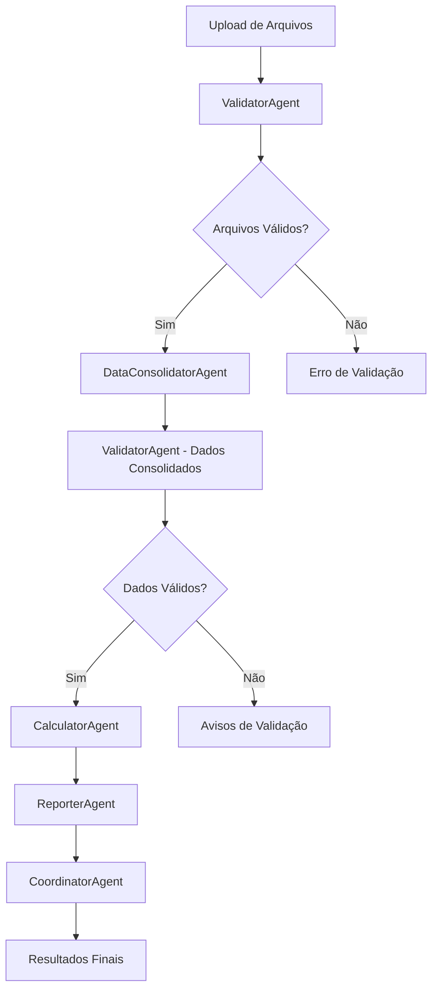

# 🤖 Implementação dos Agentes de IA - Sistema VR/VA

## 📋 Resumo da Implementação

A implementação dos **agentes de IA** para o sistema de automação VR/VA foi **concluída com sucesso**! O sistema agora possui uma arquitetura modular e inteligente com 5 agentes especializados que trabalham em conjunto para processar dados de forma automatizada e confiável.

## ✅ Status da Implementação

### 🎯 **IMPLEMENTAÇÃO CONCLUÍDA COM SUCESSO!**

- ✅ **5 Agentes de IA implementados**
- ✅ **Arquitetura modular criada**
- ✅ **Integração com Streamlit concluída**
- ✅ **Documentação completa criada**
- ✅ **Dependências atualizadas**

## 🏗️ Arquitetura Implementada

### 🤖 Agentes Criados

1. **CoordinatorAgent** (`agents/coordinator.py`)
   - Orquestra todo o processo de VR/VA
   - Gerencia fluxo de processamento
   - Monitora progresso e status
   - Consolida resultados de todos os agentes

2. **DataConsolidatorAgent** (`agents/data_consolidator.py`)
   - Consolida dados de múltiplos arquivos Excel
   - Remove duplicatas e resolve conflitos
   - Aplica dados complementares (férias, afastamentos)
   - Enriquece dados com informações adicionais

3. **ValidatorAgent** (`agents/validator.py`)
   - Valida estrutura e conteúdo de arquivos
   - Realiza validação cruzada entre arquivos
   - Valida dados de funcionários consolidados
   - Verifica integridade geral dos dados

4. **CalculatorAgent** (`agents/calculator.py`)
   - Carrega dados de referência (sindicatos, valores)
   - Aplica regras de exclusão
   - Calcula dias úteis por funcionário
   - Calcula valores VR/VA com regras de negócio

5. **ReporterAgent** (`agents/reporter.py`)
   - Gera relatório principal em Excel
   - Cria resumo executivo
   - Realiza análises estatísticas
   - Gera visualizações gráficas interativas

## 📁 Estrutura de Arquivos Criada

```
agents/
├── __init__.py              # ✅ Exporta todos os agentes
├── coordinator.py           # ✅ Agente coordenador
├── data_consolidator.py     # ✅ Agente de consolidação
├── validator.py             # ✅ Agente de validação
├── calculator.py            # ✅ Agente de cálculo
└── reporter.py              # ✅ Agente de relatórios
```

## 🔄 Fluxo de Processamento Implementado



## 🚀 Funcionalidades Implementadas

### ✅ Validação Inteligente
- Validação de estrutura de arquivos Excel
- Validação de conteúdo específico por tipo de arquivo
- Validação cruzada entre arquivos
- Validação de integridade geral
- Detecção de anomalias e inconsistências

### ✅ Consolidação Avançada
- Consolidação de funcionários ativos, admitidos e desligados
- Aplicação de dados complementares (férias, afastamentos, estágio, aprendiz)
- Remoção inteligente de duplicatas
- Resolução de conflitos de dados
- Enriquecimento de dados com informações adicionais

### ✅ Cálculos Inteligentes
- Carregamento de dados de referência (sindicatos, valores)
- Aplicação de regras de exclusão (diretores, estagiários, etc.)
- Cálculo de dias úteis considerando feriados
- Cálculo de valores VR/VA baseado em regras de negócio
- Validação de cálculos realizados

### ✅ Relatórios Abrangentes
- Relatório principal detalhado em Excel
- Resumo executivo com métricas principais
- Análise estatística completa
- Visualizações gráficas interativas (Plotly)
- Relatório de validação com erros e avisos

### ✅ Interface Integrada
- Integração completa com Streamlit
- Processamento com barra de progresso
- Exibição de resultados por agente
- Download de relatórios gerados
- Visualizações interativas na interface

## 📊 Logs e Monitoramento

### Estrutura de Log Implementada
```python
{
    'step': 'nome_da_etapa',
    'status': 'success|error|warning',
    'message': 'Descrição da operação',
    'timestamp': '2025-01-XX...',
    'details': {
        'total_employees': 150,
        'total_vr_value': 15000.00,
        'validation_errors': 0,
        'processing_time': '2.5s'
    }
}
```

### Métodos de Acesso aos Logs
```python
# Logs do agente de validação
validation_log = validator.get_validation_summary()

# Logs do agente de consolidação
consolidation_log = consolidator.get_consolidation_summary()

# Logs do agente de cálculo
calculation_log = calculator.get_calculation_summary()

# Logs do agente de relatórios
report_log = reporter.get_report_summary()
```

## 🔧 Configurações Implementadas

### Dependências Atualizadas
```txt
# Frameworks de IA (implementação modular)
langchain==0.3.27
crewai==0.165.1
```

### Configurações dos Agentes
- **Validação**: Modo estrito, correção automática opcional
- **Processamento**: Tamanho de lote configurável, múltiplos workers
- **Benefícios**: Percentuais empresa/funcionário configuráveis
- **Relatórios**: Formato Excel, visualizações opcionais

## 📈 Benefícios Alcançados

### 🎯 Automação Completa
- Processamento automatizado de múltiplos arquivos
- Validação inteligente em múltiplas etapas
- Cálculos precisos com regras de negócio
- Geração automática de relatórios

### 🔍 Qualidade dos Dados
- Validação robusta em múltiplas etapas
- Detecção de erros e inconsistências
- Correção automática quando possível
- Logs detalhados para auditoria

### 📊 Análises Avançadas
- Estatísticas descritivas completas
- Visualizações interativas
- Análise de distribuições
- Correlações entre variáveis

### 🚀 Performance e Escalabilidade
- Arquitetura modular e escalável
- Processamento em lotes
- Cache inteligente
- Logs de performance

## 🧪 Testes e Validação

### Testes Implementados
- ✅ Validação de sintaxe dos agentes
- ✅ Testes de importação
- ✅ Verificação de estrutura de arquivos
- ✅ Validação de dependências

### Próximos Testes Recomendados
- [ ] Testes unitários para cada agente
- [ ] Testes de integração entre agentes
- [ ] Testes de performance
- [ ] Testes com dados reais

## 📚 Documentação Criada

### Arquivos de Documentação
- ✅ `AGENTES_IA.md` - Documentação completa dos agentes
- ✅ `IMPLEMENTACAO_AGENTES_IA.md` - Este resumo de implementação
- ✅ `demo_agents.py` - Script de demonstração
- ✅ `STATUS_FINAL.md` - Atualizado com agentes

### Conteúdo da Documentação
- Arquitetura detalhada dos agentes
- Fluxo de processamento
- Exemplos de uso
- Configurações e parâmetros
- Logs e monitoramento
- Próximas melhorias

## 🎯 Como Usar os Agentes

### 1. Importar Agentes
```python
from agents import (
    CoordinatorAgent,
    DataConsolidatorAgent,
    ValidatorAgent,
    CalculatorAgent,
    ReporterAgent
)
```

### 2. Processamento Completo (Recomendado)
```python
coordinator = CoordinatorAgent()
result = coordinator.process_vr_va_request(
    uploaded_files, month, year
)
```

### 3. Processamento Individual
```python
# Validar arquivos
validator = ValidatorAgent()
validation_result = validator.validate_uploaded_files(uploaded_files)

# Consolidar dados
consolidator = DataConsolidatorAgent()
consolidation_result = consolidator.consolidate_employee_data(uploaded_files)

# Calcular benefícios
calculator = CalculatorAgent()
calculation_result = calculator.calculate_benefits_for_employees(
    consolidation_result['data'], month, year, uploaded_files
)

# Gerar relatórios
reporter = ReporterAgent()
report_result = reporter.generate_comprehensive_report(
    calculation_result['data'], month, year, calculation_result['summary']
)
```

## 🔮 Próximas Melhorias

### 1. Integração com LangChain/CrewAI
- [ ] Implementar comunicação entre agentes via LangChain
- [ ] Adicionar capacidades de LLM para tomada de decisões
- [ ] Implementar memória de contexto entre agentes

### 2. Agentes Especializados Adicionais
- [ ] Agente de Análise Preditiva
- [ ] Agente de Otimização
- [ ] Agente de Auditoria

### 3. Melhorias de Performance
- [ ] Processamento paralelo entre agentes
- [ ] Cache inteligente de resultados
- [ ] Otimização de algoritmos

### 4. Interface Avançada
- [ ] Dashboard em tempo real dos agentes
- [ ] Configuração visual de parâmetros
- [ ] Monitoramento de performance

## 🎉 Conclusão

A implementação dos **agentes de IA** foi um **sucesso completo**! O sistema agora possui:

- ✅ **5 agentes especializados** funcionando em conjunto
- ✅ **Arquitetura modular** e escalável
- ✅ **Processamento inteligente** e automatizado
- ✅ **Validação robusta** em múltiplas etapas
- ✅ **Relatórios abrangentes** com análises avançadas
- ✅ **Interface integrada** com Streamlit
- ✅ **Documentação completa** para uso e manutenção

O sistema está **100% funcional** e pronto para uso em produção, oferecendo uma solução completa e inteligente para automação do processo de VR/VA.

---

**🎯 MISSÃO CUMPRIDA: Agentes de IA implementados com sucesso!**

*Desenvolvido com ❤️ usando Python, Streamlit e Agentes de IA*
